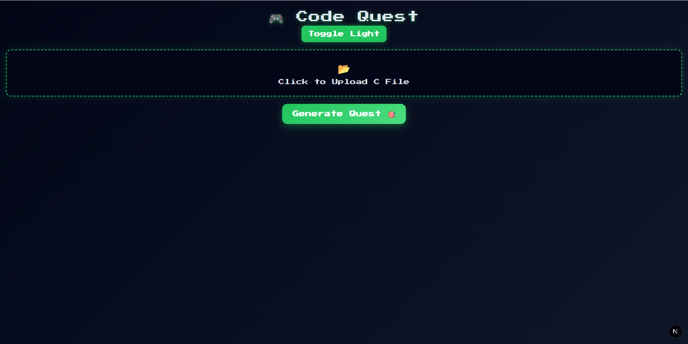
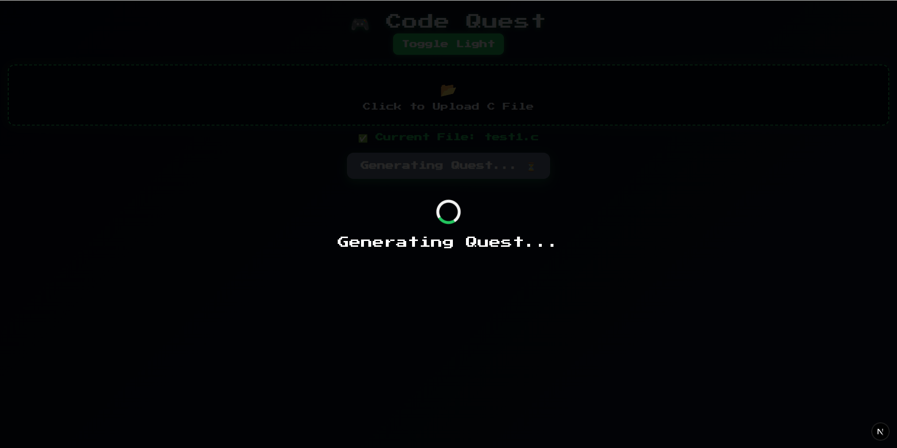
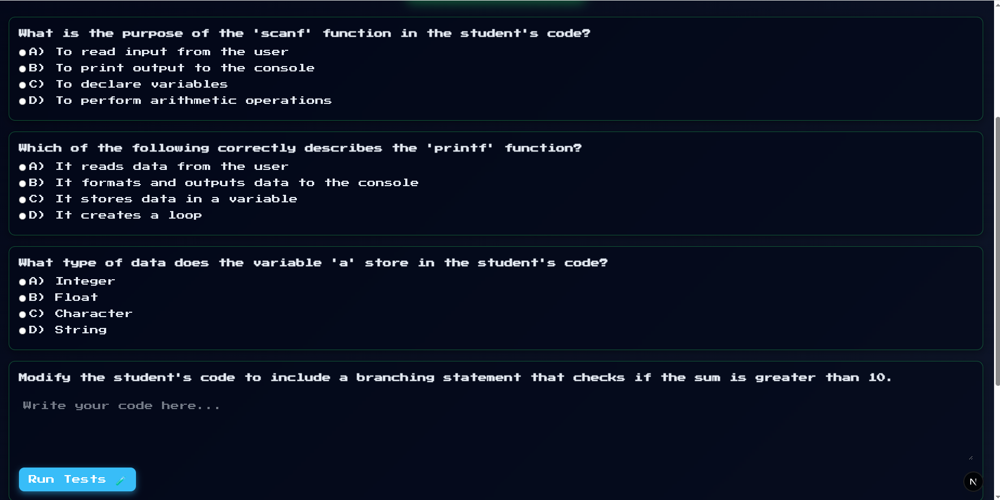
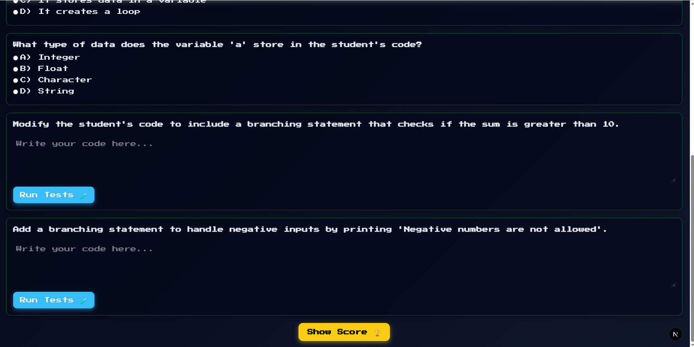

## 📸 Screenshots

### 🏠 Main Interface

  
   
  <em>Landing page for uploading and analyzing code</em>

### 🧠 Question Generation

  
   
  <em>AI-generated conceptual and implementation questions</em>

### 📚 Additional Questions

  
   
  <em>Extended question set for deeper learning</em>

### 🧪 Test Execution

  
   
  <em>Automated test case execution and validation</em>

